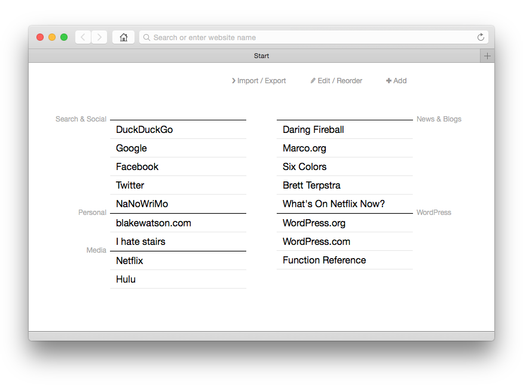

# Start

Start is a replacement for the over-the-top, built-in “recent sites” pages that appear in web browsers when you open a new tab. I created Start because I just wanted a nice list of text links, organized into little groups.

## Getting Start

The whole app is contained in the `start.html` file, so just grab that and save it somewhere. One handy trick is to put it in [Dropbox](http://dropbox.com/), that way you can get to it anywhere.

If you want, you can use the [hosted version](http://start.blakewatson.com/start.html) at my website.

The next step is to tell your web browser to use Start as your homepage and/or new tab page. The exact process varies by browser. Rather than use up a bunch of space here, I’ll simply point you to instructions on how to accomplish this step in various popular browsers:

- [Safari](http://www.wikihow.com/Change-Your-Start-Page-on-Safari)
- [Chrome (uses extension)](https://chrome.google.com/webstore/detail/replace-new-tab-page/cnkhddihkmmiiclaipbaaelfojkmlkja)
- [Firefox](http://lifehacker.com/5916533/set-a-custom-new-tab-page-in-firefox)
- [Internet Explorer](http://windows.microsoft.com/en-us/windows/open-new-tab-homepage-internet-explorer#1TC=windows-7)

## Using Start

The gist is that you add some bookmarks, which are saved in your web browser. Then those bookmarks are displayed to you in a nice click-friendly format every time you open a new browser tab.

Start has these actions:

### Add

Click the add button to add a new bookmark. You can add it to an existing bundle or create a bundle. When creating a new bundle, you can also choose what column to add the bundle to.

### Edit / Reorder

When you click the “Edit / Reorder” button, you go into _reordering mode_. You can then drag and drop to reorder your bookmarks. Click and drag a bundle’s title to move the whole bundle.

You can edit the name and URL of a bookmark by clicking it. You can also delete bookmarks by clicking the “delete key” icon that appears when hovering over a bookmark.

When you are all finished, click “Done.”

### Import / Export

Because your bookmarks are saved directly in your browser, you will need to export them if you want to use them in another browser (or on another device). Click “Import / Export” to get a copy of your export code. Copy that code, then paste it into the import box of the other browser you want to use.

## Developers

I used the Mac app, [CodeKit](http://incident57.com/codekit/), to compile everything into a single HTML file. The `start.kit` file is where most of the magic happens. The [Kit language](http://incident57.com/codekit/help.html#kit) allows for importing _any_ file, so `start.kit` grabs the CSS and JavaScript and compiles it all into `start.html`.

### Backup data

Whenever you import new bookmarks, the old ones get overwritten. While there’s no user-facing backup/restore functionality as of now, Start does make a backup of the current bookmarks before doing an import. Using your browser’s developer tools, you can manually retrieve the data from localStorage.

The primary data key is “com.blakewatson.start”. The backup data key is “com.blakewatson.start.backup”. The values are JSON strings. They can be used as-is in an import. Just copy/paste.